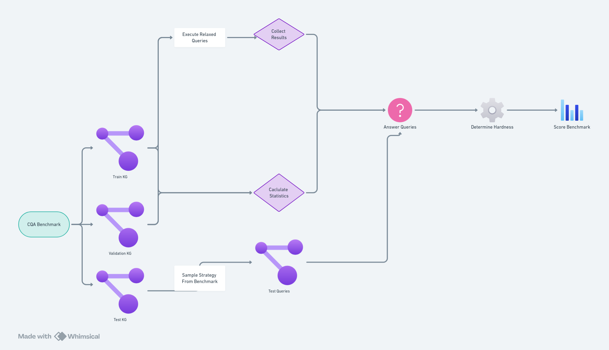

<!-- PROJECT LOGO -->
<br />
<div align="center">
    

  <h3 align="center">Query Evaluation</h3>

  <p align="center">
    A query evaluation tool for determining hardness of datasets
    <br />
    <a href="https://whimsical.com/cqa-hardness-6VFHFbr21ZgqC2Bi6nUYGz">Flow Chart</a>
  </p>
</div>


<!-- ABOUT THE PROJECT -->
## About The Project

This project provides a suite of query evaluation tools for analyzing and determining the hardness of datasets. 

### Rankers
The project implements multiple ranking strategies:
- **InDegreeRanker**: Ranks entities based on how frequently they appear as objects in triples
- **OutDegreeRanker**: Ranks entities based on how frequently they appear as subjects in triples
- **IndegreeGivenRelationRanker**: Considers relationship types when ranking based on incoming edges
- **RelaxedAnchorRanker**: Uses SPARQL queries to rank entities based on relaxed anchor patterns on the train and validation graphs


## Getting Started

To use this project, you'll need access to a GraphDB and Python 3.8 or higher installed.

### Prerequisites

1. Create a repository in your graph database and note down the repository ID
2. Set up your Python environment:
   ```sh
   python -m venv venv
   source venv/bin/activate  # On Windows: venv\Scripts\activate
   ```

### Installation

1. Clone the repository
   ```sh
   ANONIMISED (--> USE supp material)
   ```

2. Install the package in development mode
   ```sh
   pip install -e .
   ```
3. Create dataset in GraphQuerySampler from CQA benchmarks (e.g. FB15K-237 for CQA beta-e)
4. Place them in `datasets/` directory
5. Create a repository in GraphDB for the dataset with the same name as the dataset
6. Add train.nt, validation.nt to GraphDB

## Usage
To evaluate all rankers on a dummy dataset
```sh
query_evaluation evaluate --dataset harrypotterdev --ranker InDegreeRanker --query_type 1p 
```
